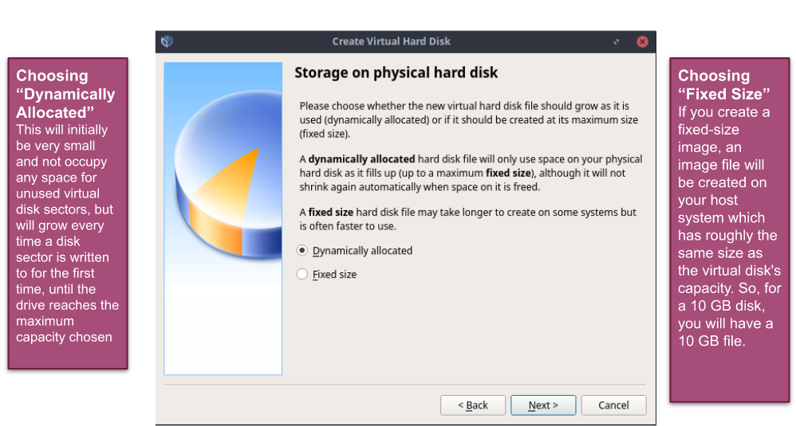

# Deliverable 2

## What is Virtualization?

Virtualization is a replication of hardware to simulate a virtual machine inside a physical machine, basically it simulates a computer inside of another computer this gives for example a way for windows and or mac machines to run linux without having to go and buy a new computer with linux installed as the Operating system. 

If you are going to virtualize using your own computer you will have to meet certain requirements to have a good experience. 

There are two general types of virtualization client-side and server-side

### Types of Virtualization 

* **Client side virtualization**
Client side virtualization is installed to a home computer unlike a server side virtualization you will need to meet the requirements to be cable of virtualization.

* **Server side virtualization**
Server side virtualization allows for a companies to host virtual machines for us the public to access. You do not need to install anything because the virtualization takes place on a server from the company. For example websites like DistroTest.net that allow the user to launch virtual machines to test Linux distributions through our web browser. 

### Hypervisor

Virtualization requires the use of a hypervisor, a hypervisor enables the hosts hardware to operate multiple virtual machines independent of each other and share the resources such as memory and RAM. There are two different types of hypervisors.

### Types of Hypervisors

* A type 1 hypervisor runs directly on the host machines hardware. Basically it does not need to load the operating system on the host computer it has direct access to drivers and other hardware. This makes it very secure and runs much faster than type 2. 

* A type 2 hypervisor is installed on top of the existing OS of the system and it relies on the host machines OS to manager its access to the CPU, memory, and storage. It is less secure and slower than type 1 hypervisors due to latency because all of the hypervisors work has to go through the hosts OS. They also cost less than type 1.

## Virtualbox 

VirtualBox is a type 2 virtualization product for enterprise and at home use. It can run on Windows, Linux, Mac and supports a large assortment of guest operating systems.

  

### How to install virtualbox in windows 10

1. First you must have virtualization enabled you can enable it through the BIOS of your system.
2. Next download the installer for the Windows host machine from [virtualbox.org](https://www.virtualbox.org/wiki/Downloads).
3. Than download the extension pack from the same place. 
4. Run the install wizard hit next, yes, and than install 
5. After waiting for the install to finish and after restarting your computer you will have successfully installed virtualbox.

### How to create a virtual machine
1. First in VirtualBox click the New button to create a new virtual machine.
2. The first step is to name, pick the folder it will be located, the type of operating system and than the version of the operating system. 
3. Next you set the amount of RAM you want to use for your Virtual machine the amount can vary based on your host computer but you want to use at least 2GB of RAM.
4. Next you choose if you want a virtual hard disk and how much space want to allocate to your VM.
5. Now choose your hard disk file type.
6. Next choose if you want the size of your hard disk to change based on how much you have stored on it or to be a fixed size.
7. Now choose the amount of space for your hard disk.  

## Installing Ubuntu in a virtual machine
1. Launch your virtual machine and you will be but in Ubuntu to install it. 
2. Double click the Ubuntu installer. 
3. Click what language you want your system in and click continue. 
4. Choose your keyboard layout than continue. 
5. Choose what type of installation you want and choose any other options needed. 
6. For the installation type pick erase disk and install ubuntu. 
7. Click continue to the warning the installer gives you. 
8. Click whatever your location is on the where are you screen and than continue. 
9. On the Who are you screen enter your computers name, username, and password than click continue. 
10. After waiting for the installation to finish restart the virtual machine and your install will be complete.

## Updating Ubuntu 

There are two ways to update Ubuntu one is to simply type software update into your applications. 

The other is to use the command `sudo apt update; sudo apt upgrade -y`

## Installing software In Ubuntu

Any software can be installed in Ubuntu by using the command line.
* You can install using the command `sudo apt install + package name`
* For example if you would like to install a program to play Tetris you can use a program called quadrapassel and use the command `sudo apt install quadrapassel -y`
* You can also delete software in a similar way with the command `sudo apt remove + package name`
* For example `sudo apt remove quadrapassel -y` will remove the Tetris game.

## Basic Linux Commands

There are many simple commands to use in linux some include:

| command | what it does                                                 |
|---------|--------------------------------------------------------------| 
| echo    |display a line of text                                        |
| fortune |print a random, hopefully interesting, adage                  |
| cowsay  |configurable speaking/thinking cow (and a bit more)           |
| lolcat  |rainbow coloring for text                                     |
| figlet  |display large characters made up of ordinary screen characters|
| toilet  |display large colorful characters                             |
| rig     |Random Identity Generator                                     |
| man     |shows the manual for any command                              |

### Navigating the filesystem

The linux file system has many commands that are useful to navigate through it. For example:

| Command |    What it does |      Syntax          | Example |
| ------- | --------------- | ---------------- | ------- |
| pwd     | Display the current working directory | pwd | pwd |
| cd      | Change the current working directory | cd + destination | cd /home/user/Documents |
| ls      | Display all the files inside a given directory | ls + option + file or dir |ls -a ~/Pictures|

### Managing files and directories

There are very powerful commands that can be used to manage files and directories in the Linux system some include:

| Command | Description  |  Syntax  | Examples |
| ------- | ------------ | -------- |----------|
| mkdir   | Creates a single or multiple directories | mkdir + name of directory | mkdir wallpapers |
| touch   | Creates files  | touch + filename | touch list |
| rm      | Removes files  | rm + filename    | rm list |
| rmdir   | Remove empty directories | rmdir + directory name | rmdir wallpapers |
| mv      | Moves and renames directories | mv + source + destination | mv Downloads/cat.png Documents/ | 
| cp      | Copies files/directories | cp + files to copy + destination | cp Downloads/wallpapers.zip Pictures/ |
| ln      | Create a hard link | ln + file + destination | ln file ~/Downloads/fileHL |
| man     | Shows the manual for commands | man + command | man ls | 
