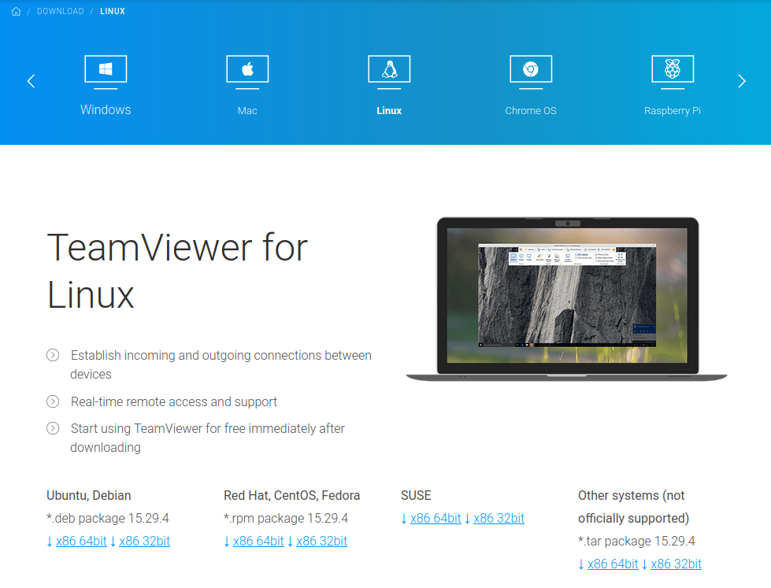

# Deliverable 3

## Connecting Ubuntu to the internet
Connecting Ubuntu to the internet is very easy, all you need is a wireless-enabled computer.

## Every day tasks In Ubuntu

### Internet browsing
The purpose of a internet browser is to connect computers to websites from around the world. It acts as a gateway into the online world. Linux offers many of the most used internet browsers.

#### Firefox 

Firefox comes pre-installed with Ubuntu, Firefox or Mozilla Firefox is a free and open-sourced web browser, it is a good choice for Linux because it is a open-source program. It protects people's privacy more than Google who has been known to spy on it's users.

#### Alternatives 

* Google Chrome: A internet browser that is available on Linux, it is developed by google is a free software that is not open-source even though most of it's code came form a open-sourced project.
* How to install Chrome
  * It is very easy to install chrome on Linux you simply have to download the installer and follow the instructions which you can download at https://www.google.com/chrome/downloads/?platform=linux
  

### Reading email
In this day and age reading emails is one of the most important ways to communicate to your friends, family, work, and much more. There are many different email programs that are available on Linux Ubuntu specifically comes with Thunderbird.

### Thunderbird
Thunderbird can be easily found in the software center and is completely free and open source email service that is developed by the Mozilla foundation. It can also be used for news feed, chat, and a calendaring client. It is very easy to find in the software center by typing in Thunderbird.

Thunderbird is very easy to setup and you can link your current email, calendar, and address book to it. You can even join different news group so you will get alerts whenever certain news is released. 

#### Alternatives
* Mailspring: Uses very little RAM and CPU, free and available in the software center.
* Claws-mail: Provides support for many plugins to get additional features such as mail filtering.
  
### Remote assistance
Remote assistance is important because if you have a problem with your computer that you can not fix on your own, you can contact someone to take over your computer and see if they can identify the problem. One of these many applications is TeamViewer. 

#### TeamViewer 
TeamViewer is available for many platforms and can be used across platforms. For example a computer running linux can control a computer running windows and vice versa. Installing TeamViewer is very simple at this link https://www.teamviewer.com/en-us/download/linux/ It is available for many different Linux distributions.

  
### Office productivity (writing documents, editing spreadsheets and doing presentations)
There are many different office apps to be used on Linux such as Google docs/slides, Microsoft 365 online, and Libre Office which comes pre installed with Ubuntu. All of these programs have their own pros and cons but I personally prefer Microsoft Office.

#### Microsoft Office

Microsoft 365 is a subscription service offered by Microsoft that comes with Office 365. This contains many of the staple apps that people have used all their lives. Such as Word, PowerPoint, and Excel. It also comes with their own email service Outlook. I personally recommend and use Office more than anything else is because of it being cross-platform and it being both browser and computer based, meaning anything I do on my home computer is saved onto the Office website and can be accessed anywhere remotely and used on other platforms such as my Linux computer.

### Streaming music and video
Most people use web browsers to watch videos or to listen to music such as YouTube, Spotify, and Apple Music, but some of these platforms have dedicated apps and programs that can be downloaded to listen to music without using a browser. 

#### Spotify 

Spotify is one of the most used music applications in the world and is available in the Software to be downloaded for free. Spotify is the program I use because of the same reasons I use Office, It can be used across many different platforms and all of my music and playlists are saved. It is available on my phone computer and web browsers when I am away from my home computer and has a wide variety of music selections.

### Video games
Linux is capable of running video games just as well as other Operating systems the only problem with it is that not all games come with support for Linux but with Linux becoming more and more popular more developers are implementing Linux support in their games. One of the most popular and best ways to buy and download games is Steam, which has thousands of games available and has full Linux support.

#### Steam

Steam is completely free to download and is easily available at https://store.steampowered.com/about/ it is also available on Windows and Mac. Steam actually has an entire section of games that are supported on Linux at https://store.steampowered.com/linux. The client that runs Steam is called SteamOS and is a Linux-based operating system.

### Video Chatting/calling/conferencing
With the current state of the world online conferencing and video chatting have never been more popular. Whether or not it is remote classes at school or meetings in a company everyone is using some type of conferencing app. These apps include Zoom, Google Meet, Skype, and Discord all these apps are also available on Linux.
#### Zoom 

I believe Zoom is the best choice for video conferences it is the most popular, and has a variety of applications. It can be used as a big meeting for many people for things such as school or company meetings. Zoom can be downloaded at https://support.zoom.us/hc/en-us/articles/204206269-Installing-or-updating-Zoom-on-Linux for many different versions of Linux and you can use either a GUI or the terminal. 

#### Alternatives 
* Skype: Skype is good in my opinion for smaller scale video chatting for example talking to family or friends.
* Google meet: Is a good alternative to Zoom for large scale meetings for school because it can link to a Google Classroom account. 
  
### Texting/Instant messaging
Texting and or Instant messaging is a big part of society today and there are many apps and programs to use such as Discord and WhatsApp I personally prefer Discord as it is very popular and good looking. It is also available on a variety of platforms including mobile. 

#### Discord 

Discord is a very popular app that can be used for many things school clubs, gaming groups, and many other communities. There are lots of settings and ways to setup your discord server to make it look very nice and have many different voice channels texting channels for your group. Discord is free and easily downloadable at https://discord.com/download it is one of the most useful apps I have ever used.

### Programing
Programing in Linux is very easy and compatible. Ubuntu comes with a command line version of python pre-installed, and the Ubuntu developers write many of its scrips and tools in Python. You can easily code inside of the terminal. To use the terminal you can simply type python3 and it will launch the python interactive mode.

You can also use text editors to write programs for more complicated programs.

### Educational Applications 

I found many Educational Applications that are in Linux one that stood out to me was GoldenDict it is a open-source dictionary app that is written in C++. It is a cross-platform tool that lets you look up words on Wikipedia to get a lot of information and it has a massive library of images and words and can be downloaded from its github repository https://github.com/goldendict/goldendict. It can be installed on Ubuntu by the command "$ sudo apt install goldendict"

### How to get help with your Ubuntu machine
You can find help for practically any problem with Ubuntu on the internet, specially the Ubuntu Forums, the help and man command for help with the command line. But any problem you could have can be easily searched in a web browser to find answers to your problems. Ubuntu also has a entire page dedicated to community support at https://ubuntu.com/support/community-support.

### Sources
https://help.ubuntu.com/stable/ubuntu-help/net-wireless-connect.html.en
https://en.wikipedia.org/wiki/Google_Chrome
https://support.google.com/chrome/a/answer/9025903?hl=en
https://en.wikipedia.org/wiki/Mozilla_Thunderbird
https://www.teamviewer.com/en-us/download/linux/
https://en.wikipedia.org/wiki/Microsoft_365#Components
https://www.pluralsight.com/blog/software-development/introduction-to-python-programming-in-ubuntu-linux
https://www.ubuntupit.com/best-dictionary-apps-for-linux/
https://ubuntu.com/support/community-support