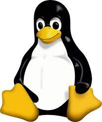
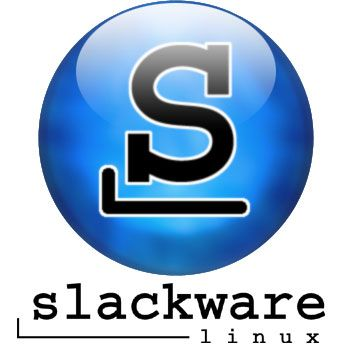

# Deliverable 1

  ## Introduction

  I will be doing the default project, this project is about showing what Ubuntu is capable of as an everyday operating system. It will focus on showing how to complete everyday tasks such as reading email, and browsing the internet. This project will show how install, setup, and update Ubuntu. As well as how to effectively use the command line and install software via the command line. 

  ## Project hardware and software requirements
   * A computer that can is capable of virtualization
   * Hypervisor installed

  ## What is Linux?

 Linux is a Unix-like Operating System that consists of a kernel, libraries, and utilities. Linux is available in many distributions. It is completely open-source and is available to download for free. Linux contains many important tools that are used in server programs and programing languages. Linux can also be installed and run on almost any system.
    
  ### Short history of linux
* Event 1: Linux was released on September 17, 1991
* Event 2: When Linux was first released it was not Open Source, as of version .12 of the Linux Kernel it was released under a General Public License.
* Event 3: Slackware and Debian are released.
* Event 4: GNOME was created and was important in the spread of desktop linux.
* Event 5: Ubuntu was released and marketed itself for ease of use.
* Event 6: Laptops started distributing laptops with Ubuntu installed on them.
* Event 7: Android was released which was the first mobile OS based on the Linux Kernel.
* Event 8: Google announced Chrome OS which was based on the Linux Kernel.
* Event 9: Support for larger amounts of files and higher volumes with sizes going up to 1 exabyte.
* Event 10: Raspbian and the Raspberry Pi launch.
  
  ### Linux distribution
 
  * **Slackaware**: Slackware is a distribution of Linux and was released in 1993 it is considered to be one of the Grandfathers of all other Linux Distributions. Slackware can run in many different forms, it can be used as a basic desktop workstation or as a server. It has been worked on by millions of users, and has a large range of tools and libraries for users. 

  
  * **Debian**: The Debian Project began in 1993, by a group of people who wanted to create a more coherent Linux Distribution. It is an all-volunteer organization that is dedicated to promoting Open-Source and free software.

     
  
  > **Debian Based Linux Distributions**

  > Ubuntu: Based on Debian and was created to be a more user friendly version of Linux. It is free and has both community and professional support. The Ubuntu community is built upon their Manifesto which is that the software will always be free, it will have tools to make it usable for everyone in their own language, users will be able to alter or customize it however they see fit.

  > Kali Linux: Based on Debian and was 
  created with a collection of security and forensics tools. It has a choice of four popular desktop environments, and has many security updates with seamless upgrades to newer versions. 
  

  * **Red Hat Enterprise Linux**: Red hat Enterprise Linux was created and targeted toward the commercial market, Red hat uses strict trademark rules to restrict free re-distribution of its officially supported versions of Red Hat. However it still provides its source code so Third-party programs can be redistributed by taking out the non-free components.
  

  > Fedora: Fedora Linux is a Linux distribution that is developed by a community-supported Fedora Project which is owed by Red Hat. Fedora Linux is distributed under a free and open-source license and focuses on innovation, it integrates new technology early and has many custom variations that target specifics interests such as security, scientific computing, and robotics.
  
        
  ### Open Source VS Closed Source

  Software like many other things is a type of intellectual property that is governed by copyright laws to protect the copyright holder from someone stealing their work and using for their own gain. However open source software uses licenses which are documents that alter the terms under which the software is released. Open Source software can be distributed for a free or free of charge and the software's source code is given with the software. Closed Source's software does not give the source code with it, the user is restricted from modifying the code.

### Advantages of Open Source
* Community support that can support other users and continue to update software years after it is created.
* Transparency, the software being delivered with its source code gives you full visibility of the code and does not have anything in it that is hidden like in proprietary software.
* Better security because the software is more thoroughly reviewed by the community, and most issues are patched out faster than proprietary software.

### Disadvantages of Open Source
* Usability, not all open source software is made with usability in mind, some do not even have a user interface
* Hidden costs, such as maintenance, support, and training on how to use the software.
* Compatibility issues, such as proprietary hardware and drivers need to run some programs

### Advantages of Closed Source
* Usability, the software is created with the consumer in mind so the technology is simple to use and usually does not require a lot of technical knowledge. 
* Testing, some closed source software programs come with trial or test versions to see if the software fits their needs.
* Liability and warranty, if software damages your hardware some products have warranty and some form of liability if something goes wrong.

### Disadvantages of Closed Source
* Cost, Closed Source software comes at a much higher cost than Open Source
* Inability to change the code to meet your needs, some things you need might never be added to the software.
* Reliability, If you purchase a Closed Source software you are at the mercy of the developer, fixing issues and bugs is all up to them so it can take longer for updates.

### The Free software movement
The Free Software Foundation is a critical force in the open source world. It was founded in 1985 and manifests itself as a general public license. They define four specific software freedoms:
* Freedom 0: Use the software for any purpose.
* Freedom 1: Examine the source code and modify it as you see fit.
* Freedom 2: Redistribute the software.
* Freedom 3: Redistribute your modified software.
These freedoms are enforced by their license.

# Sources
https://www.youtube.com/watch?v=r0H8dnJmtYU
https://www.youtube.com/watch?v=sheqhcrE1gs
https://distrowatch.com/table.php?distribution=kali
https://distrowatch.com/table.php?distribution=redhat
https://distrowatch.com/table.php?distribution=fedora