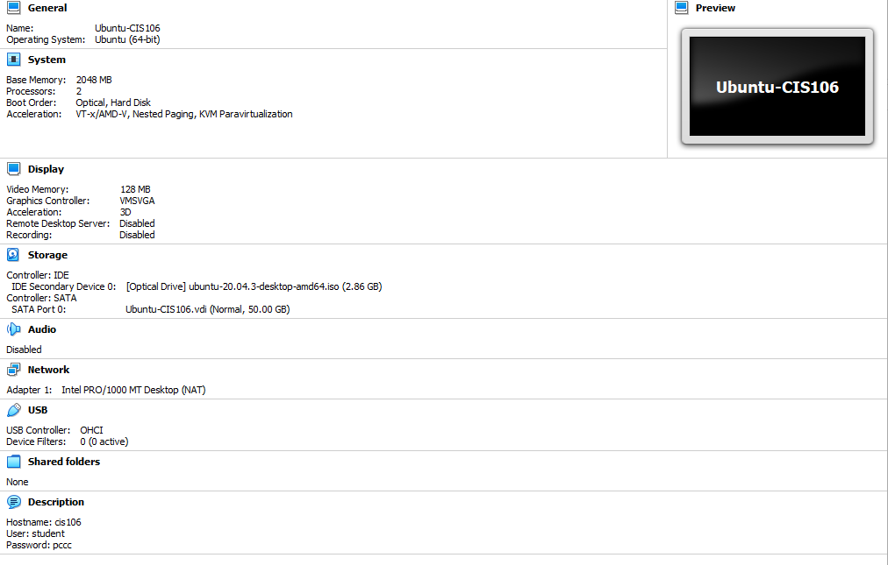
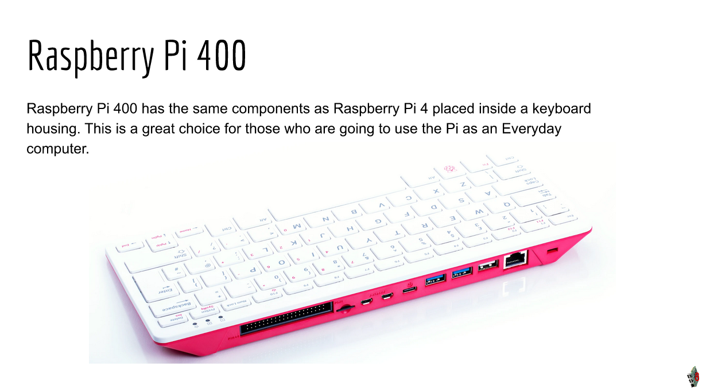

# Week Report 2
## Summary of Presentations

# The Basics Of Virtualization 

Virtualization is a replication of hardware to simulate a virtual machine inside a physical machine.

There are two different types of virtualization which are server-side virtualization and client-side virtualization.

There are many benefits to using Virtualization

   * Allows running of multiple OSs on one machine
   * Allows applications to be tested before installing them onto a host machine
   * Reduces the costs of running a network by decreasing the amount of physical hardware you need.

Requirements for Virtualization 

# Installing Ubuntu In Virtualbox 

# What Is The Raspberry Pi 

Raspberry Pi is a low cost, credit-card that plugs into a computer monitor or TV, it is able to do everything a desktop computer can do with a basic keyboard and mouse.

* Pi Zero W
* Pi 3 A+
* Raspberry Pi 3

Latest Model Raspberry Pi 400

 Projects that can be used on a Raspberry Pi
 * Wi-Fi Extender
 * Security Camera 
 * Remote-Controlled 3D Printer
 * Language Translator
 * Network Attached Storage (NAS)
