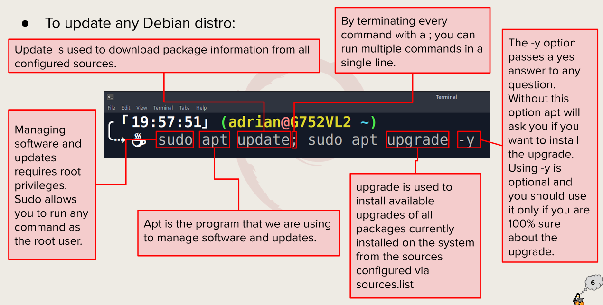

# Week Report 3
## Summary of Presentations

# Exploring Desktop Environments

* GNOME
* KDE
* Openbox
* MATE
* LXDE

## Definitions of GUI, and DE

GUI stands for graphical user interface ut us a set of programs that allow the user to interact with the system using icons, and windows. Making it more user-friendly when using the system.

DE is am implementation of a bundle of programs running on top of a computer operating system, which shares a common GUI, and is sometimes described as a graphical shell.

## Common elements of a desktop environment. 

* Desktop Settings
* Display Manager
* File Manager 
* Various Icons
* Favorites Bar
* Launcher
* Menus
* Panels
* Widgets
  
# The bash Shell

## What is a shell
A shell is a program that allows you to control your computer using commands in a command line interface instead of using GUIs.

## Different Shells

* Tcsh Shell
* Csh Shell
* Ksh Shell
* Zsh Shell
* Fish Shell
  
## Bash shortcuts

* Ctrl + A - Go to the start of the command line
* Ctrl + E - Go to the end of the command line
* Ctrl + K - Delete from cursor to the end of the command line
* Ctrl + U - Delete from cursor to the start of the command line
* Ctrl + Y - Paste word or text that was cut using one of the deletion shortcuts.
  
## List Of Basic Commands

* Date - Displays the current time and date
* Cal - Displays a calendar of the current month
* df - Displays the current amount of free space on our disk drives
* free - Displays the amount of free memory
* uname - Displays the information about your system
* clear - Clears the screen

# Managing Software

## Command for updating Ubuntu

sudo apt update; sudo apt upgrade - y

## Command for installing software

sudo apt install "package name" -y

## Command for removing software

sudo apt remove "package name"- -y

## Command for searching for software

apt search "web browser"

## Definition of terms

Package - Archives that contain binaries of software, configuration files, and information about dependencies.

Library - Reusable code that can be used by more than one function or program.

Repository - A large collection of software available for download.

## Screenshot on how to update Ubuntu

