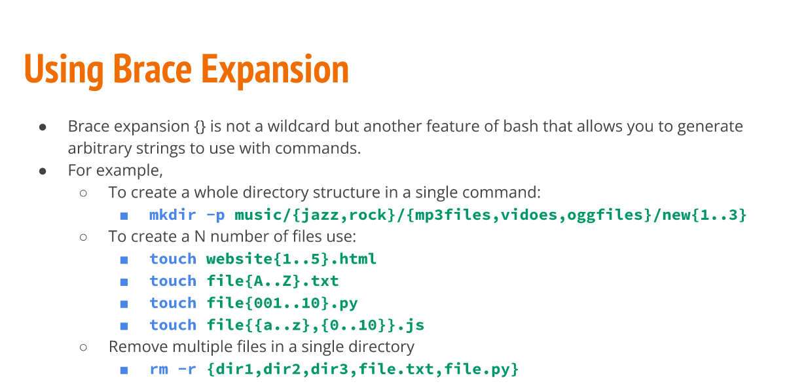

# Week Report 5

## Definitions 

| Command | Description  |  Syntax  | Examples |
| ------- | ------------ | -------- |----------|
| mkdir   | Creates a single or multiple directories | mkdir + name of directory | mkdir wallpapers |
| touch   | Creates files  | touch + filename | touch list |
| rm      | Removes files  | rm + filename    | rm list |
| rmdir   | Remove empty directories | rmdir + directory name | rmdir wallpapers |
| mv      | Moves and renames directories | mv + source + destination | mv Downloads/cat.png Documents/ | 
| cp      | Copies files/directories | cp + files to copy + destination | cp Downloads/wallpapers.zip Pictures/ |
| ln      | Create a hard link | ln + file + destination | ln file ~/Downloads/fileHL |
| man     | Shows the manual for commands | man + command | man ls | 

## Brace expansion

