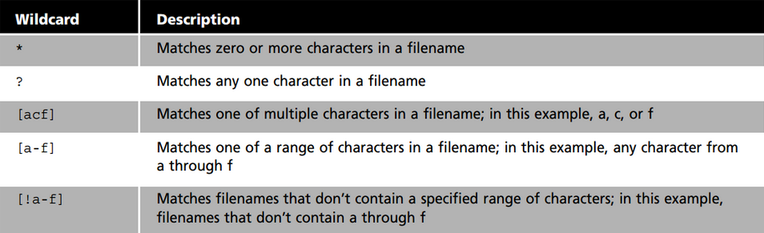
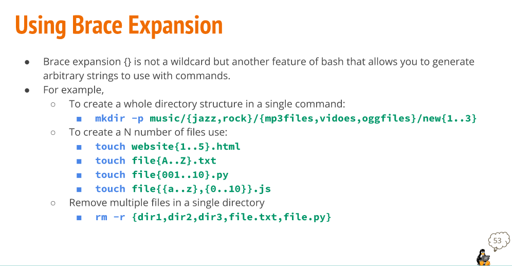

# Wildcards

Wildcard represents letters and characters used to specify a file name for searches. They are officially called meta character wildcards. You can use a wildcard to get a long list of all files in the current directory starting with "new." 

Their are 3 Wildcards *, ?, and [] each have their own use in the filesystem.

This is a cheat sheet that shows many popular uses for the Wildcards.

# Brace Expansion and how to use it

Brace expansion {} is not a wildcard. It is another feature of bash that allows you to generate strings to use with commands. 

 