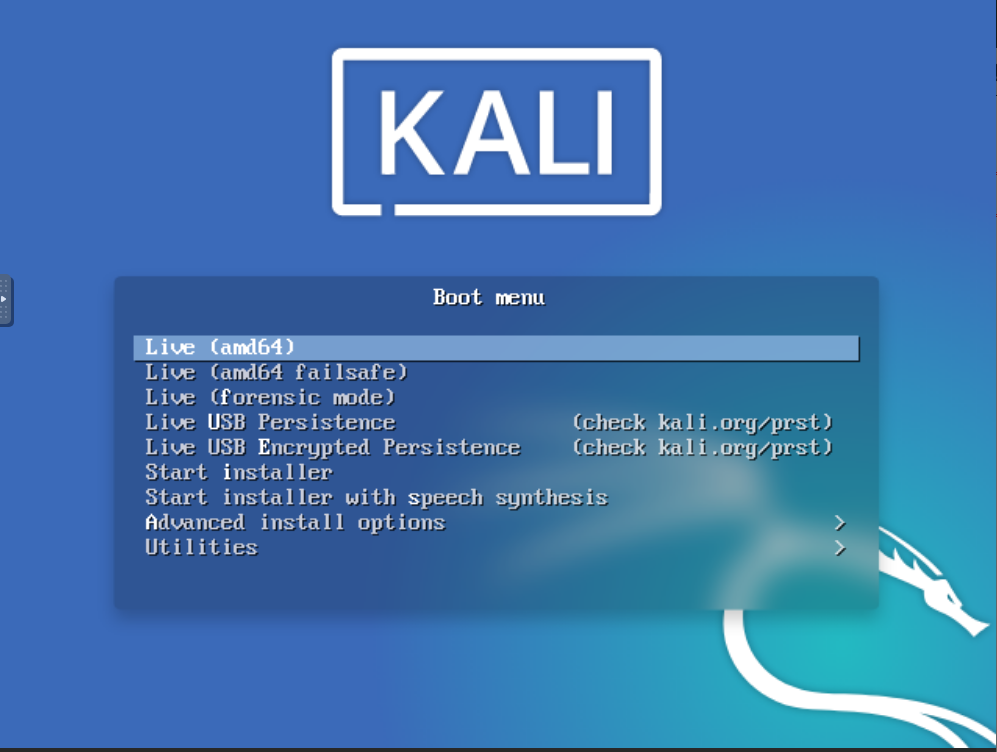
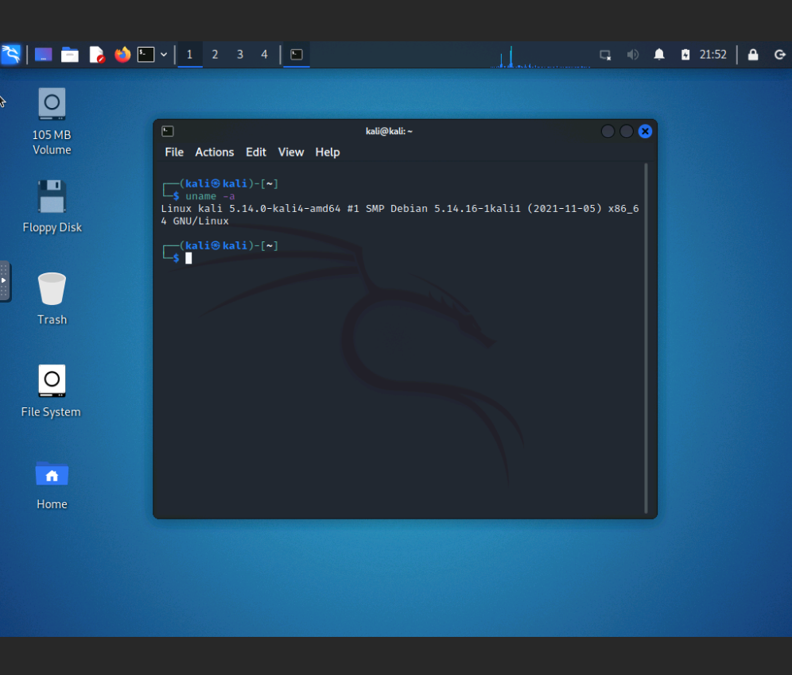
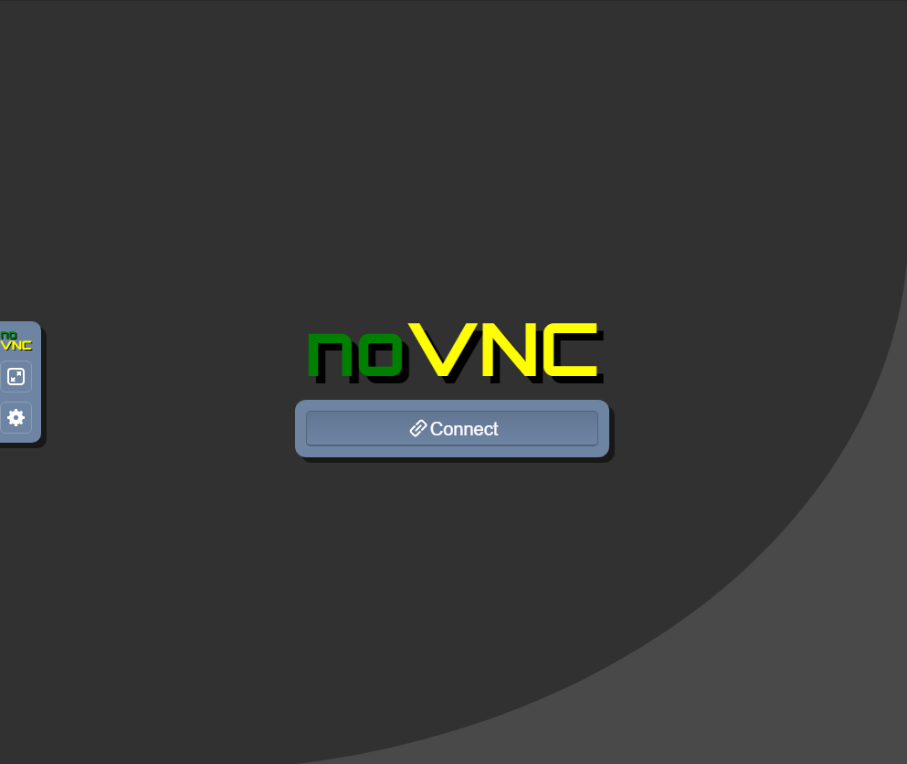

# Lab 1 Exploring Linux distributions

## Question 1

1. What is the OS Type:
**Linux**
2. Which major distro is it based on?
**Debian**
3. Which processor architecture does it support?
**armhf, ppc64el, riscv, s390x, x86_64**
4. Is the distribution active or is it discontinued?
**Active**
5. What is the distro’s home page?
	**https://www.ubuntu.com/**

## Question 2

1. What is the name of the distribution and the OS Type:
**Linux**
2. Which major distro is it based on?
**Debian**
3. Which processor architecture does it support?
**x86_64**
4. Is the distribution active or is it discontinued?
**Active**
5. What is the distro’s home page?
**http://www.pardus.org.tr/**

## Question 3

1. What is the name of the distribution?
**Tails**
2. What is the country of Origin?
**Ireland**
3. What major distribution is it based on?
**Debian**
4. What is the distribution category?
   **From RAM, Live Medium, Privacy, Security**
5. Which processor architecture, aside from the one in the original query, does the OS support?
**x86_64**
## Question 4

### A Linux distribution used for Data Rescue/Data recovery

| Distro Name | Website | Desktop Environment |
|-------------|---------|---------------------|
|Kali Linux   |http://www.kali.org/|Enlightenment, GNOME, KDE Plasma, LXDE, MATE, Xfce|

### A Linux distribution used for Education that supports the ix86 processor architecture.

| Distro Name | Website | Desktop Environment |
|-------------|---------|---------------------|
|Debian Edu/Skolelinux|http://www.skolelinux.org/|GNOME, KDE, LXDE, LXQt, MATE, Xfce|

### A Linux distribution that supports the OEM installation method

| Distro Name | Website | Desktop Environment |
|-------------|---------|---------------------|
|Pop!_OS|https://system76.com/pop|GNOME|

## Question 5 

## Question 6

