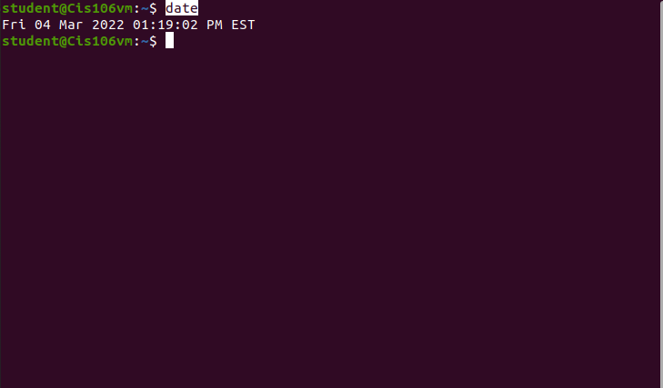

# Lab 3 Using Ubuntu

# Question 1

# Question 2

# Question 3

| Program purpose     | Package Name | Version  | Description |
| ------------------- | ------------ | -------- | ----------- |
| Play a tetris game  |quadrapassel    |1:3.36.0-1|Tetris Game  |
| Play a video file   |deepin-movie    |5.0.0-1   |Deepin movie player|
| Browse the internet |epiphany-browser|3.36.4-0  |Simple web browser|
| Read your email     |plasma-gmailfeed|1.1-2     |shows your Gmail feed with notifications|
| Play music          |mopidy-local    |3.1.1-1   |playing music from your local music archive|

Commands Answers: 

* Sub Question 1: `sudo apt install quadrapassel deepin-movie epiphany-browser plasma-gmailfeed mopidy-local -y`
  
* Sub question 2: `sudo apt remove quadrapassel deepin-movie epiphany-browser plasma-gmailfeed mopidy-local -y`
  
* Sub question 3: `sudo apt install quadrapassel+ deepin-movie+ epiphany-browser- plasma-gmailfeed- mopidy-local- vlc+`

# Question 4

| command | what it does                                                 |
|---------|--------------------------------------------------------------| 
| echo    |display a line of text                                        |
| fortune |print a random, hopefully interesting, adage                  |
| cowsay  |configurable speaking/thinking cow (and a bit more)           |
| lolcat  |rainbow coloring for text                                     |
| figlet  |display large characters made up of ordinary screen characters|
| toilet  |display large colourful characters                            |
| rig     |Random Identity Generator                                     |