# Lab 4 Linux Filesystem

# Question 1
### Table 1
| Directory |                                  Function                          |
| --------- | ------------------------------------------------------------------ |
| bin       | Essential commands                                                 |
| dev       | Device files                                                       |
| etc       | System configuration files                                         |
| home      | User home directories                                              |
| media     | Mount point for removable media, such as Dvds                      |
| opt       | Add-on software packages                                           |
| proc      | Kernel information, process control, system hardware information   |
| srv       | Information relating to services that run on the system            |
| usr       | Software not essential for system operation, such as applications  |
| var       | Dedicated to variable data, such as logs, databases, websites, and temporary spool (e-mail etc) files that persist from one boot to the next.|

### Table 2

| Command |    What it does |      Syntax          | Example |
| ------- | --------------- | ---------------- | ------- |
| pwd     | Display the current working directory | pwd | pwd |
| cd      | Change the current working directory | cd + destination | cd /home/user/Documents |
| ls      | Display all the files inside a given directory | ls + option + file or dir |ls -a ~/Pictures  |

## Practice / Challenge 

### Practice
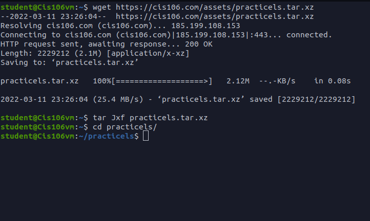
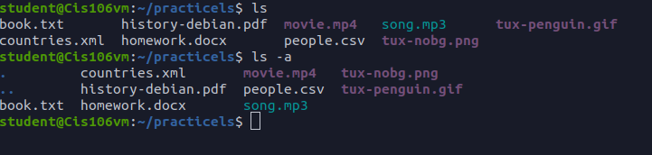
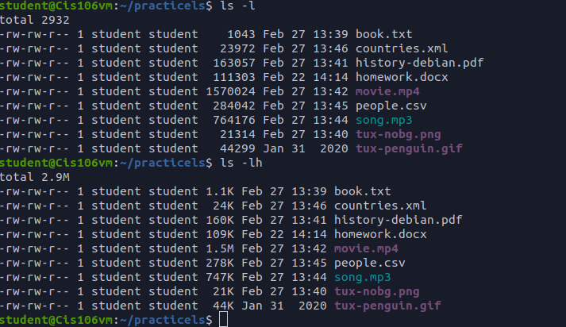
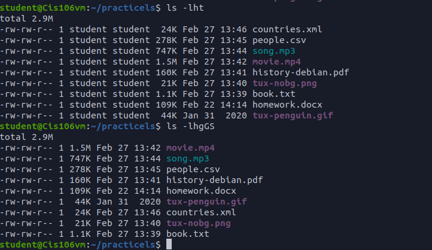
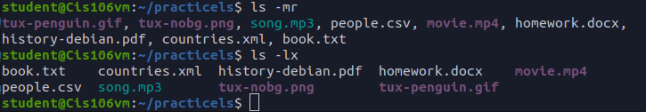

### Challenge
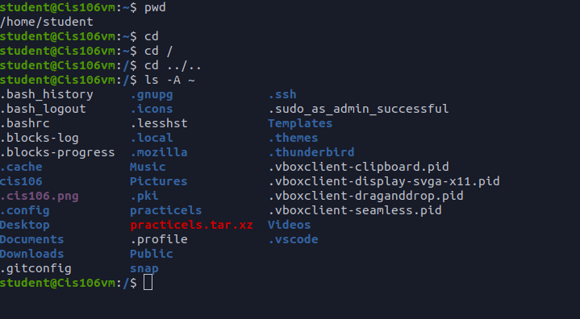
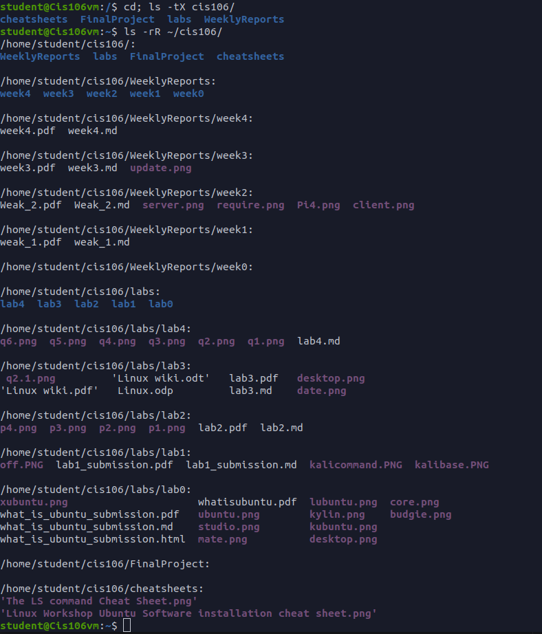
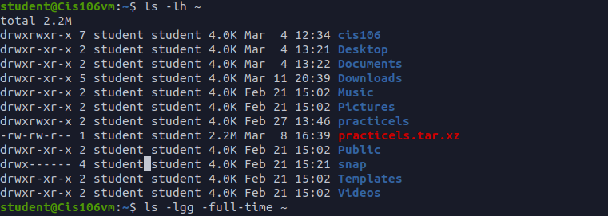

# Question 2

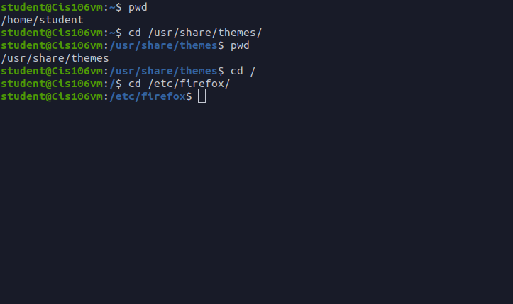
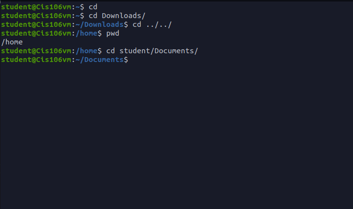

# Question 3

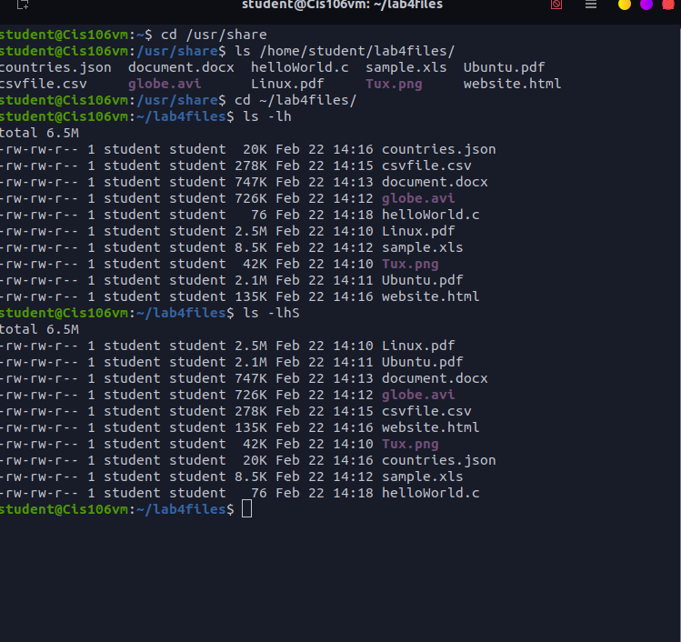
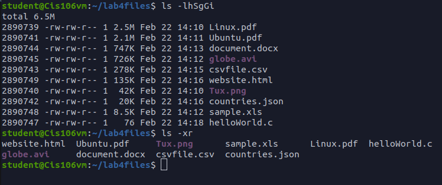

# Question 4

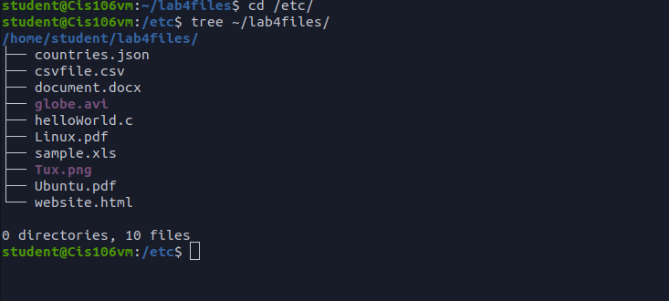
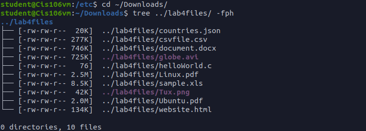
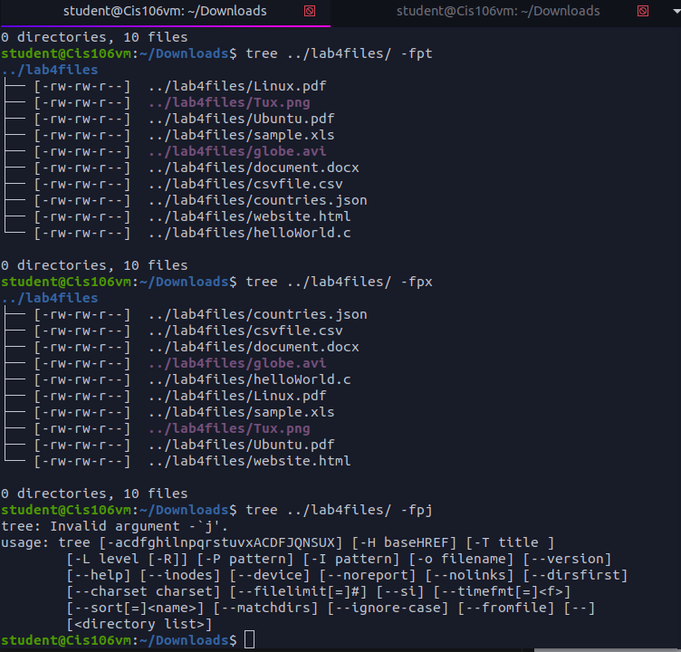

# Question 5

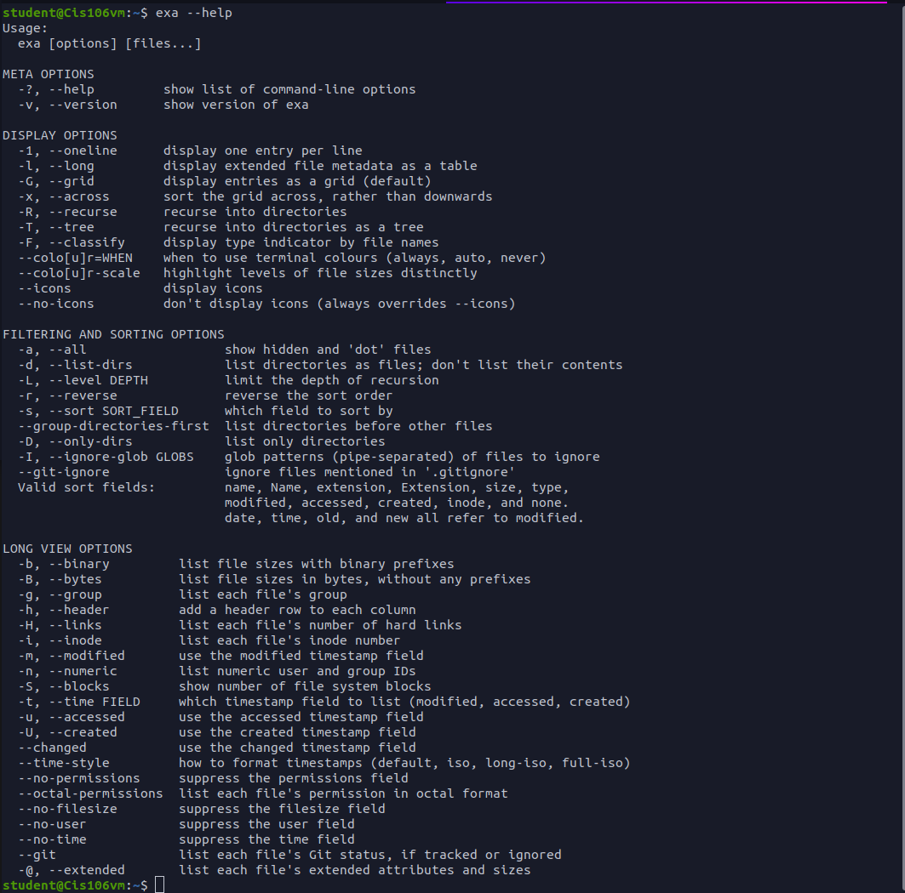
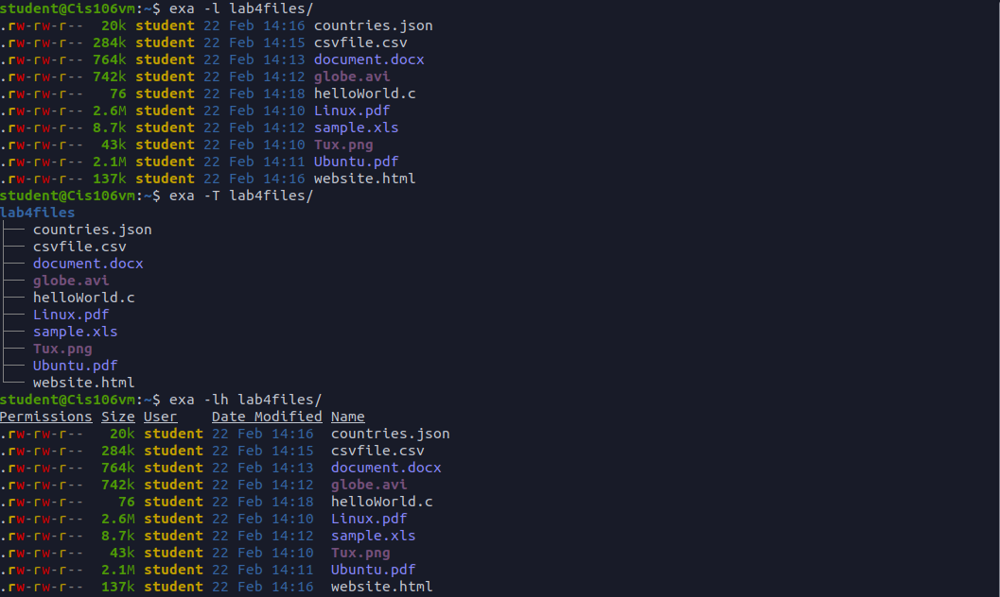
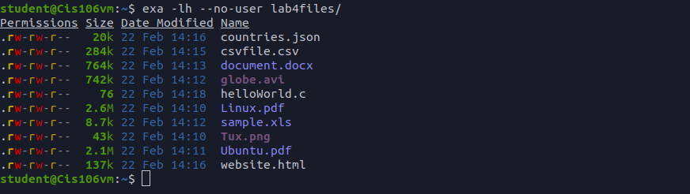
