# Question 1

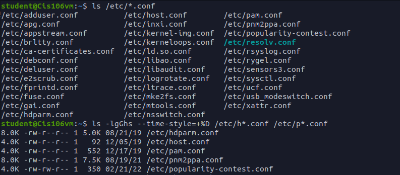

# Question 2

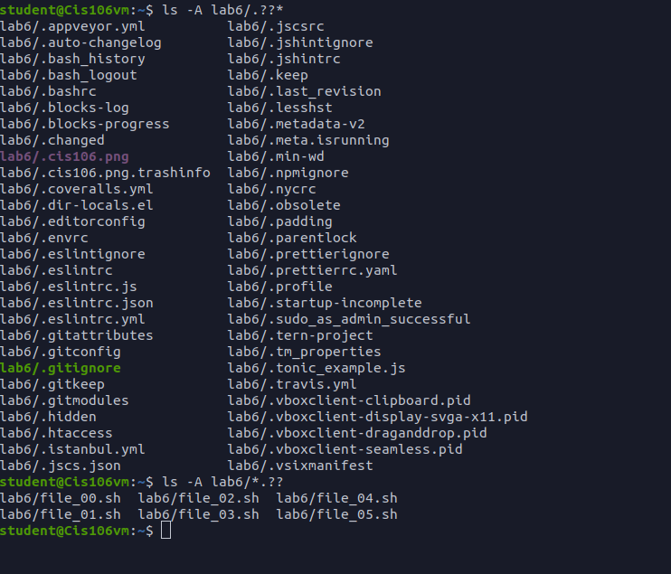

# Question 3

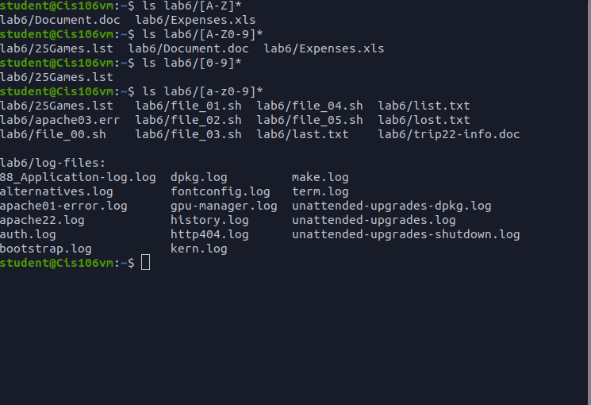

# Question 4

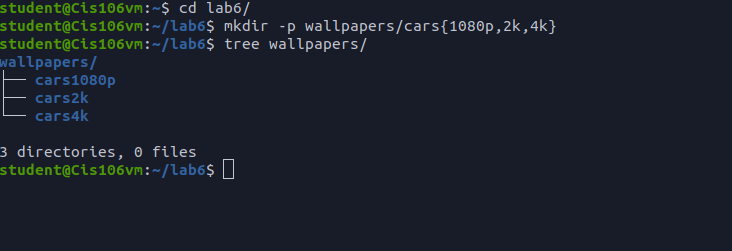

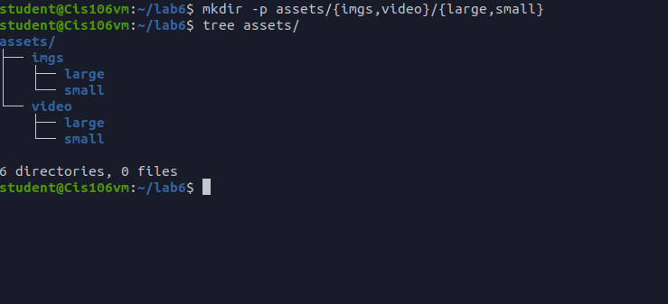

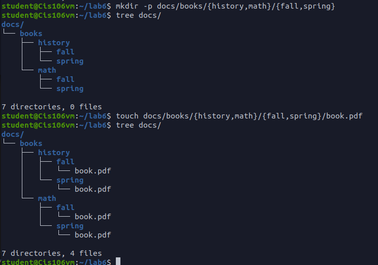

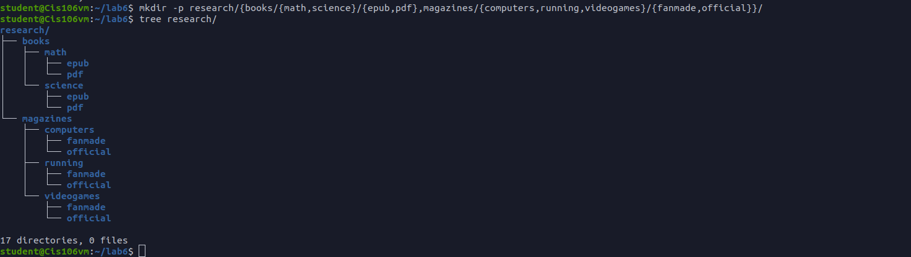

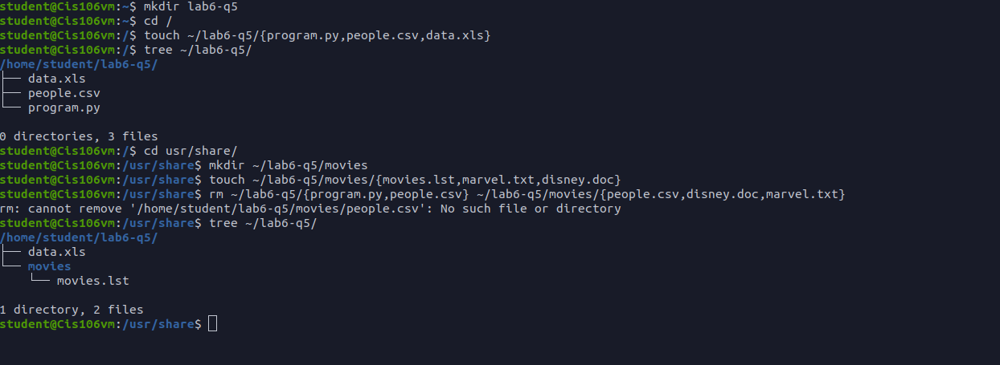

# Challenge Question

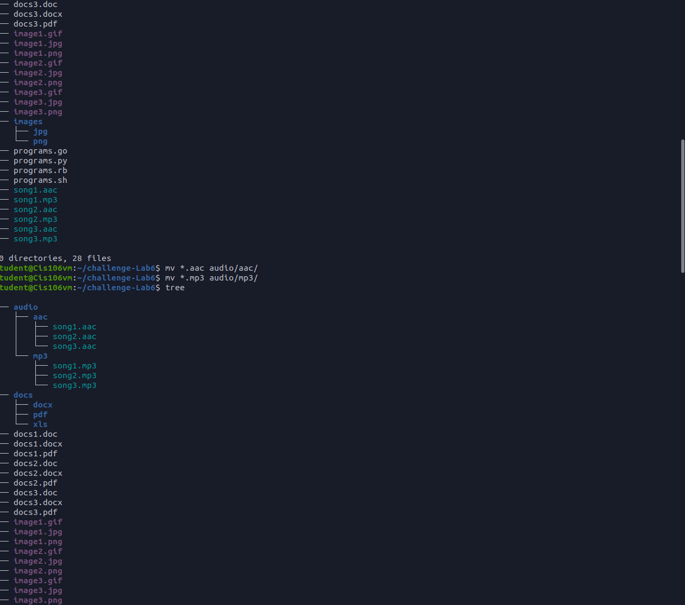

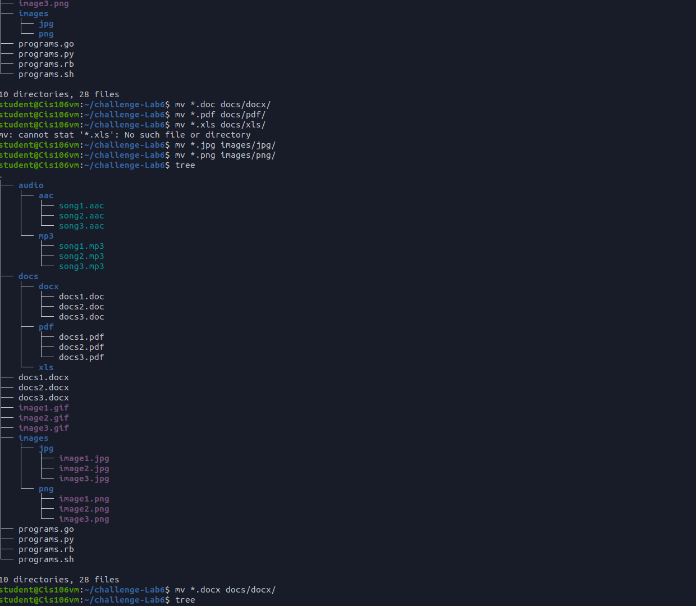

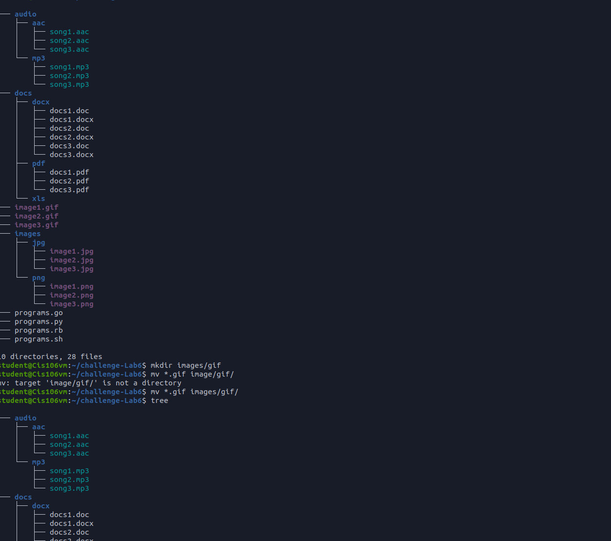

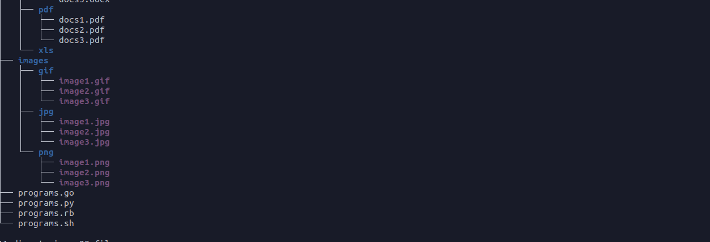

I did not see a place to put the gif files and I did not see and XLS files in the directory. So i made a gif folder inside of images and put them there.