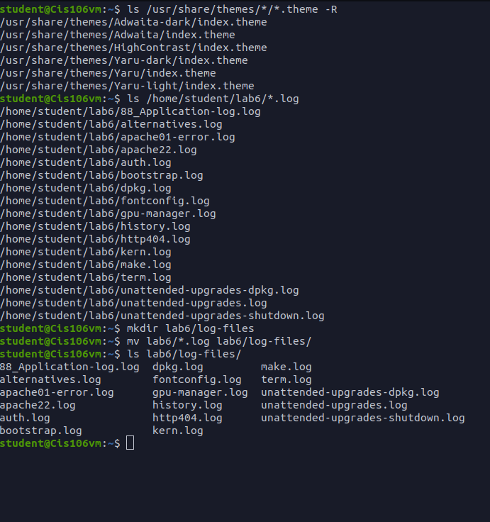
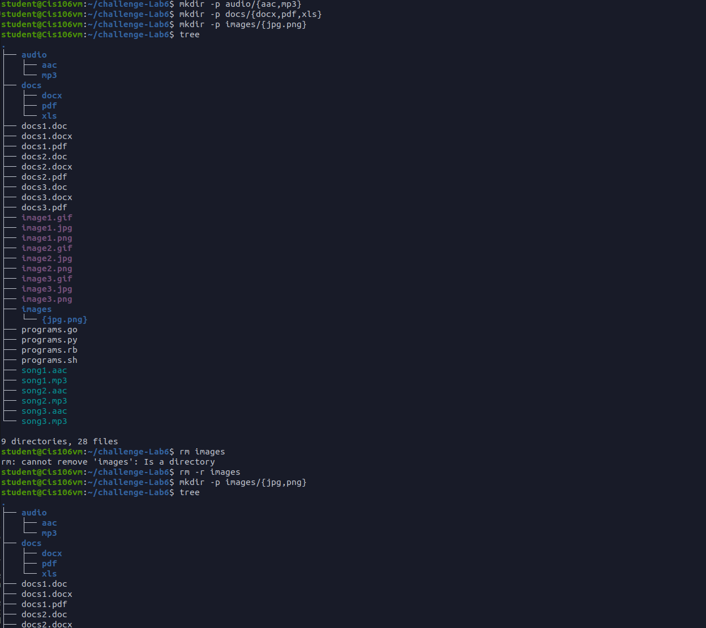

# Question 1

# Question 2

# Question 3

# Question 4

# Challenge Question

I did not see a place to put the gif files and I did not see and XLS files in the directory. So i made a gif folder inside of images and put them there.